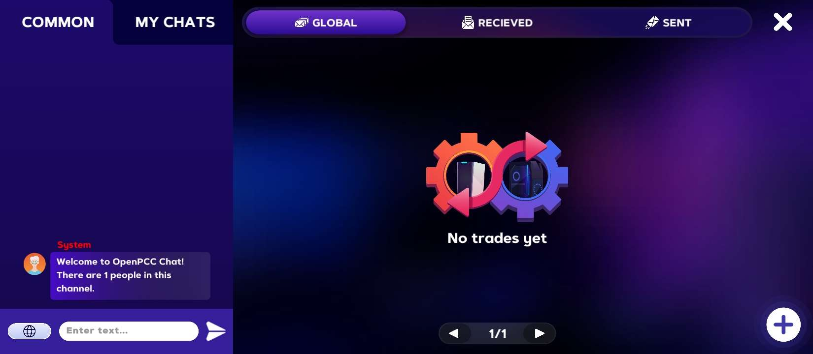

# message-exchange
Chat server reimplementation for PC Creator 2

# Public Instances
There are currently no publicly available instances to use. If you run an instance and want to be featured here, open a pull request or an issue.

# Improvements
- Strict content structure checking
- Greeting message

# Configuring
You can configure some of the things to your liking!

You will have to edit the code slightly, but it's nothing too hard!

For more advanced configurations, you will likely need programming experience, preferrably in Go

You can find the configuration values at the top of the file, right after the imports
## Greeting Configuration
### greetingEnabled (`boolean`)
> Default: `true`

If set to true, all users will receive a greeting message as they subscribe/join a channel

### greeterUsername (`string`)
> Default: `<color=red>System</color>`

The username of the greeter.

### Advanced Configuration
You can edit the `makeGreeting` function to your liking!

## Limits
### messageLengthLimit (`int`)
> Default: `300`

Max message length. Messages with length above it will just be dropped with no error.

### messageLogLimit (`int`)
> Default: `30`

How many messages the server should log in memory.

## Storage
### Filename (`string`)
> Default: `relationships.json`

The JSON file name to store relationships in.

### Advanced Configuration
If you want to use a different storage implementation (currently none), you can set the `store` variable to a structure compatible with the `storage.Storage` interface.

# Compatibility
The server does not behave 1 to 1 with the game one. However, the behaviour is pretty similar, so this works with the game.

# Building
You must have the [Go programming language](https://go.dev) installed
1. Clone the repository
2. Run the `build.sh` script
3. If prompted, install any needed dependencies and run the script again

It will output a binary named `main` that is the server
